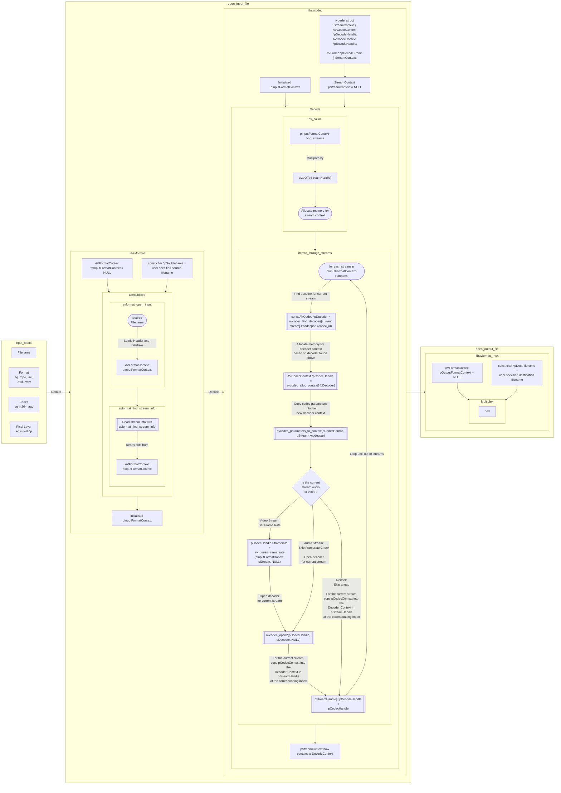

# ffmpeg_learning_testbed

```mermaid
flowchart LR

    subgraph Input_Media
        direction LR
        InputMedia0["Filename"]
        InputMediaA["Format\neg .mp4, .avi,\n.mxf, .wav"]
        InputMediaB["Codec\neg h.264, aac"]
        InputMediaB
        InputMediaC["Pixel Layer\neg yuv420p"]
    end

    subgraph open_input_file

    
    subgraph libavformat_demux ["libavformat"]
        direction TB
        libavformat_a[AVFormatContext\n*pInputFormatContext = NULL] --> Demultiplex
        libavformat_b[const char *pSrcFilename =\nuser specified source filename] --> Demultiplex
        subgraph Demultiplex
            direction TB
            subgraph avformat_open_input
                direction TB
                avformat_open_input_A([Source\nFilename]) -->|Loads Header and Initialises| avformat_open_input_B[AVFormatContext\npInputFormatContext]
            end
            avformat_open_input --> avformat_find_stream_info
            subgraph avformat_find_stream_info
                direction TB
                BA[[Read stream info with\navformat_find_stream_info]] -->|Reads pkts from| BB[AVFormatContext\npInputFormatContext]
            end
        end
        Demultiplex --> libavformat_export_a[Initialised pInputFormatContext]
    end


    subgraph libavcodec
            libavcodec_z["typedef struct StreamContext {\nAVCodecContext *pDecodeHandle;\nAVCodecContext *pEncodeHandle;\n\nAVFrame *pDecodeFrame;\n} StreamContext;"] --> libavcodec_b
            libavcodec_a[Initialised pInputFormatContext] --> Decode
            libavcodec_b[StreamContext pStreamContext = NULL] --> Decode
        subgraph Decode
            direction TB
            subgraph av_calloc
                direction TB
                av_calloc_a["pInputFormatContext->nb_streams"] -->|Multiplies by| av_calloc_b["sizeOf(pStreamHandle)"]
                av_calloc_b --> av_calloc_c([Allocate memory for\nstream context])
            end
            subgraph iterate_through_streams
                direction TB
                decodeloop_a([for each stream in\npInputFormatContext->streams:])
                decodeloop_a -->|Find decoder for current stream| decodeloop_b[["const AVCodec *pDecoder =\navcodec_find_decoder([current stream]->codecpar->codec_id)"]]
                decodeloop_b -->|Allocate memory for decoder context\nbased on decoder found above| decodeloop_c[["AVCodecContext *pCodecHandle =\navcodec_alloc_context3(pDecoder)"]]
                decodeloop_c -->|Copy codec parameters into the\nnew decoder context| decodeloop_d[["avcodec_parameters_to_context(pCodecHandle, pStream->codecpar)"]]
                decodeloop_d --> decodeloop_e{Is the current\nstream audio\nor video?}
                decodeloop_e -->|Video Stream:\nGet Frame Rate| decodeloop_f[["pCodecHandle->framerate =\nav_guess_frame_rate\n(pInputFormatHandle,\npStream, NULL)"]]
                decodeloop_f -->|Open decoder\nfor current stream| decodeloop_g[["avcodec_open2(pCodecHandle, pDecoder, NULL)"]]
                decodeloop_e -->|Audio Stream:\nSkip Framerate Check\n\nOpen decoder\nfor current stream| decodeloop_g
                decodeloop_g -->|For the current stream,\ncopy pCodecContext into the\nDecoder Context in pStreamHandle\nat the corresponding index| decodeloop_h[["pStreamHandle[i].pDecodeHandle =\npCodecHandle"]]
                decodeloop_e -->|Neither:\nSkip ahead\n\nFor the current stream,\ncopy pCodecContext into the\nDecoder Context in pStreamHandle\nat the corresponding index| decodeloop_h
                decodeloop_h -->|Loop until out of streams| decodeloop_a
            end
            av_calloc --> iterate_through_streams
            iterate_through_streams --> decode_a[pStreamContext now contains a DecodeContext\n]
            
        end
    end

    end

    subgraph open_output_file
    subgraph libavformat_mux
        libavformat_c[AVFormatContext\npOutputFormatContext = NULL] --> Multiplex
        libavformat_d[const char *pDestFilename =\nuser specified destination filename] --> Multiplex
        subgraph Multiplex
            ddd
        end
    end
    end

Input_Media -->|Demux| libavformat_demux
libavformat_demux --> |Decode| libavcodec
libavcodec --> libavformat_mux


classDef invisible fill: none, stroke: none
    
```
